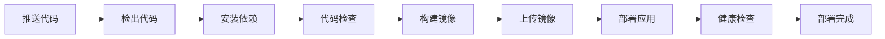

# GitHub Actions CI/CD 自动部署

本目录包含用于自动构建和部署 Tomato Tools 项目到腾讯云轻量服务器的 GitHub Actions workflows。

## 📁 文件说明

### Workflow 文件

1. **`deploy.yml`** - 基础版本

    - 使用密码认证
    - 环境变量通过命令行传递
    - 适合快速开始

2. **`deploy-with-ssh-key.yml`** - 推荐版本 ⭐
    - 使用 SSH 密钥认证（更安全）
    - 使用环境文件管理配置（更简洁）
    - 包含容器备份功能
    - 更详细的日志输出

## 🚀 快速开始

### 1. 准备服务器

在腾讯云轻量服务器上运行配置脚本：

```bash
# 下载并运行配置脚本
curl -fsSL https://raw.githubusercontent.com/your-username/your-repo/main/scripts/setup-server.sh | bash

# 或者手动下载后运行
wget https://raw.githubusercontent.com/your-username/your-repo/main/scripts/setup-server.sh
chmod +x setup-server.sh
sudo ./setup-server.sh
```

### 2. 生成 SSH 密钥（推荐）

```bash
# 在本地生成 SSH 密钥对
ssh-keygen -t ed25519 -C "github-actions-deploy" -f ~/.ssh/tomato-tools-deploy

# 将公钥添加到服务器
ssh-copy-id -i ~/.ssh/tomato-tools-deploy.pub user@your-server-ip

# 查看私钥内容（用于配置 GitHub Secret）
cat ~/.ssh/tomato-tools-deploy
```

### 3. 配置 GitHub Secrets

进入 GitHub 仓库 → Settings → Secrets and variables → Actions，添加以下 Secrets：

#### 必需的 Secrets

**服务器连接**

- `SERVER_HOST` - 服务器 IP 地址
- `SERVER_USERNAME` - SSH 用户名（如 `root` 或 `ubuntu`）
- `SERVER_SSH_KEY` - SSH 私钥内容（推荐）或 `SERVER_PASSWORD` - SSH 密码
- `SERVER_PORT` - SSH 端口（默认 22，可选）

**Next.js 公共变量**（构建时需要）

- `NEXT_PUBLIC_SUPABASE_URL`
- `NEXT_PUBLIC_SUPABASE_ANON_KEY`
- `NEXT_PUBLIC_SITE_URL`

**运行时环境变量**

- `DATABASE_URL`
- `SUPABASE_SERVICE_ROLE_KEY`
- `UPSTASH_REDIS_REST_URL`
- `UPSTASH_REDIS_REST_TOKEN`
- 其他 API 密钥（参考 `.env.example`）

### 4. 触发部署

**自动触发**：推送代码到 `main` 或 `master` 分支

**手动触发**：

1. 进入 GitHub 仓库的 Actions 页面
2. 选择对应的 workflow
3. 点击 "Run workflow" 按钮

## 📊 部署流程



## 🔍 监控和管理

### 查看部署状态

在 GitHub Actions 页面查看实时日志

### 查看应用日志

```bash
# SSH 连接到服务器
ssh user@your-server-ip

# 查看容器状态
docker ps -f name=tomato-tools

# 查看实时日志
docker logs -f tomato-tools

# 查看最近 100 行日志
docker logs --tail 100 tomato-tools
```

### 管理应用

```bash
# 重启应用
docker restart tomato-tools

# 停止应用
docker stop tomato-tools

# 启动应用
docker start tomato-tools

# 查看容器资源使用
docker stats tomato-tools
```

## 🔧 故障排查

### 构建失败

1. 检查 Dockerfile 语法
2. 确认构建参数配置正确
3. 查看 GitHub Actions 日志

### 部署失败

1. 检查 SSH 连接配置
2. 确认服务器磁盘空间充足
3. 查看服务器容器日志

### 应用无法访问

1. 检查防火墙配置（端口 3000）
2. 确认容器正在运行
3. 检查环境变量配置
4. 查看应用日志

## 🔄 回滚部署

如果新版本有问题，可以快速回滚：

```bash
# SSH 连接到服务器
ssh user@your-server-ip

# 查看备份镜像
docker images | grep backup

# 停止当前容器
docker stop tomato-tools
docker rm tomato-tools

# 使用备份镜像启动
docker run -d \
  --name tomato-tools \
  --restart unless-stopped \
  -p 3000:3000 \
  --env-file /opt/tomato-tools/.env \
  tomato-tools:backup-YYYYMMDD_HHMMSS
```

## 📚 相关文档

- [详细部署指南](../../docs/github-actions-deploy-guide.md)
- [Docker 部署文档](../../docs/DOCKER_DEPLOYMENT.md)
- [环境变量配置](../../docs/environment-variables-guide.md)

## 🎯 最佳实践

1. **使用 SSH 密钥认证**而不是密码
2. **定期备份**数据库和重要数据
3. **监控应用**性能和错误日志
4. **测试部署**在推送到生产环境前
5. **保持更新** Docker 和系统包

## 🆘 获取帮助

如果遇到问题：

1. 查看 [详细部署指南](../../docs/github-actions-deploy-guide.md)
2. 检查 GitHub Actions 日志
3. 查看服务器容器日志
4. 提交 Issue 到项目仓库

## 📝 版本历史

- v1.0 - 基础部署 workflow
- v1.1 - 添加 SSH 密钥支持和容器备份功能
