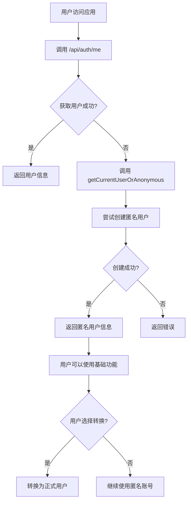

# 自动匿名登录功能

## 功能概述

当系统无法成功获取用户信息时，会自动执行匿名登录流程，为用户分配临时匿名身份，确保用户能够继续使用基础功能。

## 核心特性

- ✅ **自动触发**：用户信息获取失败时自动创建匿名账号
- ✅ **无感体验**：用户无需手动操作，系统自动处理
- ✅ **数据安全**：匿名用户数据完全隔离
- ✅ **可恢复性**：支持后续转换为正式用户
- ✅ **完整日志**：所有操作都有详细的日志记录

## 工作流程



## 实现细节

### 1. AuthService 层

在 `AuthService` 中新增了 `getCurrentUserOrAnonymous()` 方法：

```typescript
async getCurrentUserOrAnonymous(): Promise<{
  user: SupabaseUser | null;
  session: Session | null;
  isAnonymous: boolean;
  error: string | null;
}>
```

**工作流程：**

1. 首先尝试获取当前已登录用户
2. 如果获取成功，返回用户信息和匿名状态
3. 如果获取失败，自动调用 `AnonymousService.createAnonymousUser()`
4. 创建成功后返回匿名用户信息

**日志记录：**

- 记录用户获取尝试
- 记录匿名用户创建过程
- 记录所有错误信息

### 2. API 层

修改了 `/api/auth/me` 路由：

**原实现：**

```typescript
const supabaseUser = await authService.getCurrentUser();
if (supabaseUser.error || !supabaseUser.user) {
  return NextResponse.json({ error: "Not authenticated" }, { status: 401 });
}
```

**新实现：**

```typescript
const result = await authService.getCurrentUserOrAnonymous();
if (result.error || !result.user) {
  return NextResponse.json(
    { error: result.error || "Failed to get user" },
    { status: 500 },
  );
}
```

### 3. 前端 Context 层

更新了 `AuthContext` 中的 `fetchUser` 方法：

**新增参数：**

```typescript
const fetchUser = async (autoCreateAnonymous: boolean = true)
```

**自动创建逻辑：**

1. 当 API 返回 401 或网络错误时
2. 如果 `autoCreateAnonymous` 为 true
3. 自动调用 `createAnonymousUser()`
4. 避免无限循环（创建后调用 `fetchUser(false)`）

### 4. UserService 层

新增辅助方法：

```typescript
// 检查用户是否为匿名用户
async isAnonymousUser(userId: string): Promise<boolean>

// 获取用户完整信息（包括配置）
async getUserWithProfile(userId: string): Promise<{
  user: User | null;
  profile: UserProfile | null;
}>
```

## 使用场景

### 场景 1：首次访问应用

```
用户打开应用 → 无登录状态 → 自动创建匿名账号 → 可以使用基础功能
```

### 场景 2：会话过期

```
用户会话过期 → 获取用户失败 → 自动创建新的匿名账号 → 继续使用
```

### 场景 3：网络错误

```
网络请求失败 → 无法获取用户 → 自动创建匿名账号 → 保证可用性
```

## 数据结构

### 匿名用户特征

```typescript
{
  id: "uuid",                              // Supabase 生成的唯一 ID
  email: "anonymous_<uuid>@temp.local",    // 临时邮箱
  fullName: "临时用户",                     // 默认名称
  role: "anonymous",                        // 角色标识
  isAnonymous: true,                        // 匿名标识
  anonymousCreatedAt: Date,                 // 创建时间
  expiresAt: Date,                          // 过期时间（30天后）
}
```

### 数据库字段

在 `user` 表中：

- `is_anonymous`: BOOLEAN - 标识是否为匿名用户
- `anonymous_created_at`: TIMESTAMP - 匿名用户创建时间
- `expires_at`: TIMESTAMP - 过期时间

## 安全考虑

### 1. 数据隔离

- 每个匿名用户拥有独立的 UUID
- 数据库级别的用户隔离
- 无法访问其他用户的数据

### 2. 过期机制

- 匿名账号默认 30 天后过期
- 可通过定时任务清理过期账号
- 过期后数据自动删除（CASCADE）

### 3. 权限控制

- 匿名用户角色为 `anonymous`
- 可以限制某些功能仅对正式用户开放
- 通过中间件控制路由访问

### 4. 转换机制

- 支持将匿名用户转换为正式用户
- 转换时保留所有数据
- 需要邮箱验证确保安全

## 日志记录

所有关键操作都有详细的日志记录：

### AuthService 日志

```typescript
// 尝试获取用户或创建匿名用户
logger.info("Attempting to get current user or create anonymous user");

// 找到当前用户
logger.info({ userId: user.id }, "Current user found");

// 创建匿名用户
logger.info("No current user found, creating anonymous user");

// 创建成功
logger.info(
  { userId: anonymousResult.user.id },
  "Anonymous user created successfully",
);

// 错误记录
logger.error(
  { error: anonymousResult.error },
  "Failed to create anonymous user",
);
```

### API 日志

```typescript
// 请求接收
logger.info("Get current user request received");

// 成功响应
logger.info(
  { userId: result.user.id, isAnonymous: result.isAnonymous },
  "Current user retrieved successfully",
);

// 错误响应
logger.error({ error: result.error }, "Failed to get or create user");
```

## 配置要求

### 环境变量

```env
# Supabase 配置
NEXT_PUBLIC_SUPABASE_URL=your-supabase-url
NEXT_PUBLIC_SUPABASE_ANON_KEY=your-anon-key
SUPABASE_SERVICE_ROLE_KEY=your-service-role-key

# 站点 URL
NEXT_PUBLIC_SITE_URL=http://localhost:3000
```

### Supabase 设置

在 Supabase Dashboard 中启用匿名登录：

1. 进入 **Authentication > Settings**
2. 找到 **"Anonymous sign-ins"** 选项
3. 启用该功能

### 数据库迁移

确保已执行匿名用户相关的数据库迁移：

```bash
pnpm db:migrate
```

## 测试流程

### 1. 测试自动创建

```bash
# 清除所有 cookies
# 访问应用首页
# 检查是否自动创建匿名用户
curl http://localhost:3000/api/auth/me
```

### 2. 测试会话恢复

```bash
# 登录后删除 session
# 刷新页面
# 检查是否自动创建新的匿名用户
```

### 3. 测试转换功能

```bash
# 以匿名用户身份登录
# 调用转换 API
curl -X POST http://localhost:3000/api/auth/convert \
  -H "Content-Type: application/json" \
  -d '{
    "email": "test@example.com",
    "password": "password123",
    "fullName": "测试用户"
  }'
```

## 前端集成示例

### 使用 AuthContext

```tsx
import { useAuth } from "@/contexts/AuthContext";

function MyComponent() {
  const { user, loading } = useAuth();

  if (loading) {
    return <div>加载中...</div>;
  }

  return (
    <div>
      {user?.isAnonymous ? (
        <div>
          <p>您正在使用临时账号</p>
          <button
            onClick={() => {
              /* 显示转换对话框 */
            }}
          >
            转为正式账号
          </button>
        </div>
      ) : (
        <div>
          <p>欢迎，{user?.fullName}</p>
        </div>
      )}
    </div>
  );
}
```

### 条件渲染

```tsx
function FeatureComponent() {
  const { user } = useAuth();

  if (user?.isAnonymous) {
    return (
      <div>
        <p>此功能仅对正式用户开放</p>
        <button>立即注册</button>
      </div>
    );
  }

  return <div>{/* 功能内容 */}</div>;
}
```

## 后续优化建议

### 1. 数据迁移

在用户转换时，自动迁移匿名用户的所有数据：

- 待办事项
- 用户设置
- 使用记录

### 2. 使用统计

记录匿名用户的使用情况：

- 创建数量
- 转换率
- 活跃度

### 3. 功能限制

对匿名用户进行合理限制：

- API 调用频率限制
- 数据存储上限
- 功能访问权限

### 4. 定时清理

设置定时任务清理过期的匿名用户：

```typescript
// 每天凌晨执行
// 删除过期超过 30 天的匿名用户
// 清理关联数据
```

## 故障排查

### 问题 1：匿名用户创建失败

**可能原因：**

- Supabase 未启用匿名登录
- 数据库连接失败
- 环境变量配置错误

**解决方法：**

1. 检查 Supabase 设置
2. 验证数据库连接
3. 确认环境变量

### 问题 2：无限循环创建

**可能原因：**

- `fetchUser` 参数使用不当
- 创建后未正确设置 session

**解决方法：**

1. 确保 `createAnonymousUser` 调用 `fetchUser(false)`
2. 检查 cookie 设置

### 问题 3：数据未保留

**可能原因：**

- 用户 ID 不一致
- 数据库外键关系错误

**解决方法：**

1. 确认转换时使用相同的 user ID
2. 检查数据库 schema

## 相关文件

### 服务层

- `src/modules/auth/auth.service.ts` - 认证服务
- `src/modules/auth/anonymous.service.ts` - 匿名用户服务
- `src/modules/user/user.service.ts` - 用户服务

### API 层

- `src/app/api/auth/me/route.ts` - 获取当前用户
- `src/app/api/auth/anonymous/route.ts` - 创建匿名用户
- `src/app/api/auth/convert/route.ts` - 转换用户

### 前端层

- `src/contexts/AuthContext.tsx` - 认证上下文

### 数据库

- `src/lib/drizzle/schema/schema.ts` - 数据库 schema
- `src/lib/drizzle/migrations/0005_add_anonymous_user_fields.sql` - 迁移文件

## 总结

自动匿名登录功能通过以下方式提升用户体验：

1. **降低使用门槛**：无需注册即可体验
2. **提高转化率**：用户体验后更愿意注册
3. **保证可用性**：即使会话失效也能继续使用
4. **数据安全**：完整的隔离和过期机制

该功能已完全集成到认证流程中，无需额外配置即可使用。

---

**实现日期**: 2025-11-12  
**版本**: v1.0.0  
**作者**: Tomato Tools Team
