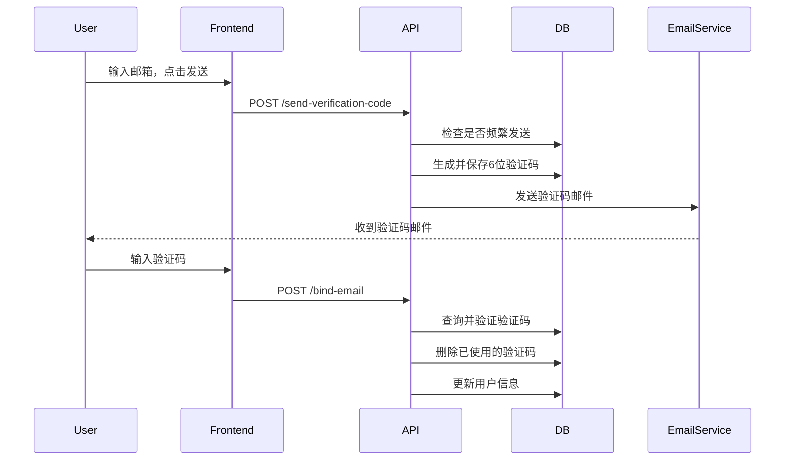
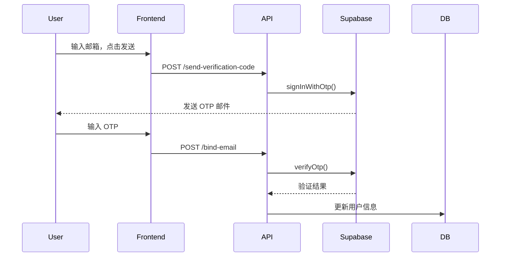

# Supabase Email OTP 迁移文档

## 概述

本文档记录了从自定义邮箱验证码系统迁移到 Supabase Email OTP 的过程。

## 迁移原因

1. **统一认证体系**：使用 Supabase Auth 统一管理所有认证相关功能
2. **简化代码**：减少自定义验证码的数据库表和相关逻辑
3. **提高安全性**：利用 Supabase 的安全机制和最佳实践
4. **降低维护成本**：减少自定义代码，依赖成熟的第三方服务

## 迁移内容

### 1. 发送验证码 API

**文件**: `src/app/api/auth/send-verification-code/route.ts`

**变更**:

- ❌ 移除：自定义验证码生成逻辑
- ❌ 移除：`email_verification` 表的数据库操作
- ❌ 移除：自定义邮件发送逻辑
- ✅ 新增：使用 `supabase.auth.signInWithOtp()` 发送 Email OTP

**代码示例**:

```typescript
const { error } = await supabase.auth.signInWithOtp({
  email,
  options: {
    shouldCreateUser: false, // 不自动创建用户，仅用于验证
  },
});
```

### 2. 绑定邮箱 API

**文件**: `src/app/api/auth/bind-email/route.ts`

**变更**:

- ❌ 移除：从 `email_verification` 表查询验证码
- ❌ 移除：删除已使用验证码的逻辑
- ✅ 新增：使用 `supabase.auth.verifyOtp()` 验证 Email OTP

**代码示例**:

```typescript
const { error: verifyError } = await supabase.auth.verifyOtp({
  email,
  token: code,
  type: "email",
});
```

### 3. AnonymousService 更新

**文件**: `src/modules/auth/anonymous.service.ts`

**变更**:

- ✅ 更新：`convertToRegularUser` 方法的注释，说明需要先验证 OTP
- ✅ 保持：原有的用户升级逻辑不变

### 4. 前端表单更新

**文件**: `src/app/auth/login/LoginForm.tsx`

**变更**:

- ✅ 更新：验证码输入提示文本
  - "请输入6位验证码" → "请输入邮箱收到的6位验证码"
  - "验证码必须是6位数字" → "验证码必须是6位"
- ✅ 更新：成功提示文本
  - "验证码已发送到您的邮箱" → "验证码已发送到您的邮箱，请查收"

## 已删除的文件和代码

### 删除的 API 路由

- ❌ `src/app/api/auth/verify-code/route.ts` - 独立的验证码验证接口（已不需要）

### 可选清理项（建议保留一段时间）

- `email_verification` 数据库表定义（在 `schema.ts` 中）
- 相关的类型定义：`EmailVerification`, `NewEmailVerification`

> **注意**：建议先在生产环境运行一段时间，确认没有问题后再删除数据库表。

## Supabase 配置要求

### 1. 环境变量

确保以下环境变量已正确配置：

```env
NEXT_PUBLIC_SUPABASE_URL=your-supabase-url
NEXT_PUBLIC_SUPABASE_ANON_KEY=your-anon-key
SUPABASE_SERVICE_ROLE_KEY=your-service-role-key
NEXT_PUBLIC_SITE_URL=http://localhost:3000
```

### 2. Supabase Dashboard 设置

#### 启用 Email OTP

1. 进入 Supabase Dashboard
2. 导航到 **Authentication > Providers**
3. 找到 **Email** 提供商
4. 确保以下选项已启用：
   - ✅ Enable Email provider
   - ✅ Enable Email OTP

#### 配置邮件模板（可选）

1. 导航到 **Authentication > Email Templates**
2. 选择 **Magic Link** 模板（OTP 使用相同模板）
3. 自定义邮件内容和样式

#### 配置速率限制

Supabase 默认有速率限制，防止滥用：

- 同一邮箱：60秒内只能发送一次
- 同一IP：每小时限制次数

可以在 **Authentication > Rate Limits** 中调整。

## 工作流程对比

### 旧流程（自定义验证码）



### 新流程（Supabase Email OTP）



## 优势对比

| 特性           | 自定义验证码                 | Supabase Email OTP    |
| -------------- | ---------------------------- | --------------------- |
| **代码复杂度** | 高（需要自己实现）           | 低（调用 API）        |
| **数据库表**   | 需要 `email_verification` 表 | 不需要额外表          |
| **邮件发送**   | 需要配置邮件服务             | Supabase 自动处理     |
| **安全性**     | 需要自己实现防护             | Supabase 内置安全机制 |
| **速率限制**   | 需要自己实现                 | Supabase 自动处理     |
| **验证码管理** | 需要手动清理过期验证码       | Supabase 自动管理     |
| **维护成本**   | 高                           | 低                    |

## 测试清单

### 功能测试

- [ ] 发送验证码功能正常
- [ ] 验证码邮件能正常收到
- [ ] 输入正确验证码能成功绑定
- [ ] 输入错误验证码会提示错误
- [ ] 过期验证码会提示错误
- [ ] 速率限制功能正常（60秒内不能重复发送）
- [ ] 绑定成功后用户数据正确更新
- [ ] 匿名用户数据成功保留

### 边界测试

- [ ] 无效邮箱格式的处理
- [ ] 验证码格式错误的处理
- [ ] 网络错误的处理
- [ ] Supabase 服务异常的处理

## 回滚方案

如果需要回滚到自定义验证码系统：

1. 恢复以下文件的旧版本：

   - `src/app/api/auth/send-verification-code/route.ts`
   - `src/app/api/auth/bind-email/route.ts`
   - `src/modules/auth/anonymous.service.ts`
   - `src/app/auth/login/LoginForm.tsx`

2. 恢复 `src/app/api/auth/verify-code/route.ts` 文件

3. 确保 `email_verification` 表仍然存在

## 注意事项

1. **邮件模板**：Supabase 的 OTP 邮件使用默认模板，可能需要自定义以匹配品牌风格

2. **验证码格式**：Supabase OTP 默认是6位数字，与原来的自定义验证码一致

3. **有效期**：Supabase OTP 默认有效期为60秒，比原来的5分钟短

4. **速率限制**：Supabase 的速率限制可能比自定义的更严格，需要注意用户体验

5. **错误处理**：需要正确处理 Supabase 返回的各种错误类型

## 相关文档

- [Supabase Auth - Email OTP](https://supabase.com/docs/guides/auth/auth-email-otp)
- [Supabase Auth - Rate Limits](https://supabase.com/docs/guides/auth/rate-limits)
- [项目认证系统文档](./AUTO_ANONYMOUS_LOGIN.md)

## 更新日期

- 创建日期：2025-11-14
- 最后更新：2025-11-14
