# AI对话上下文记忆 - 架构设计

## 🏗️ 系统架构

### 整体架构图

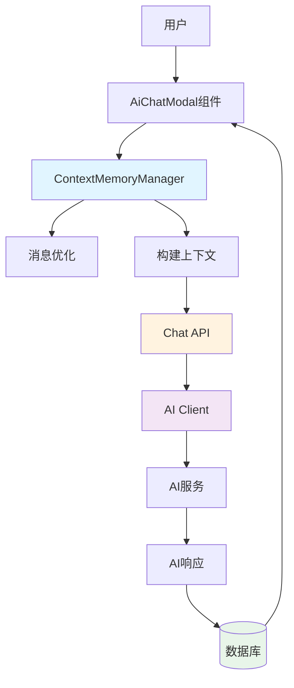

### 数据流程图

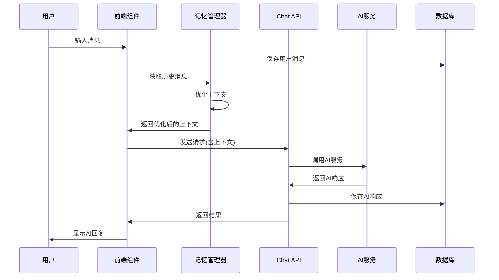

## 📦 模块设计

### 1. ContextMemoryManager（核心模块）

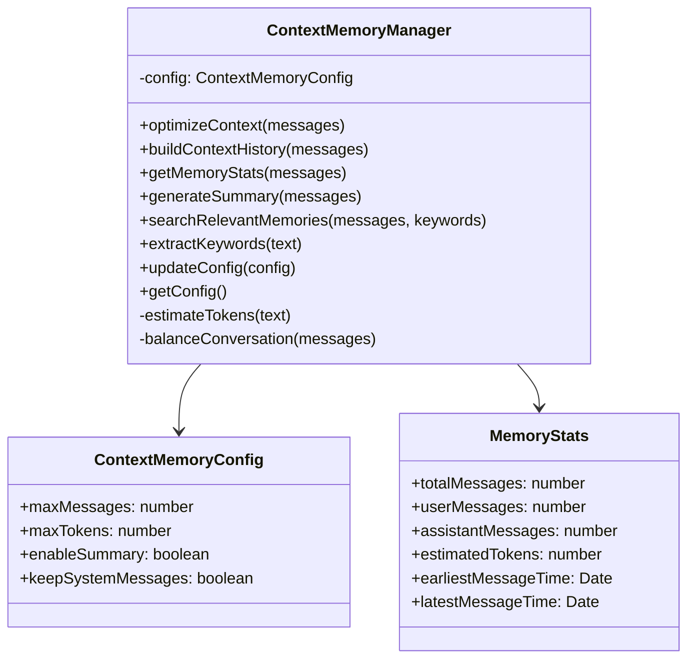

### 2. 消息处理流程

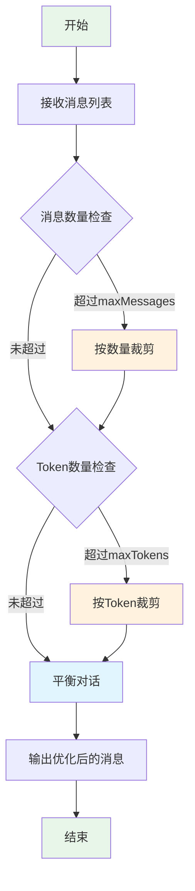

### 3. Token估算算法

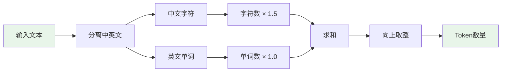

## 🔄 交互流程

### 用户发送消息流程

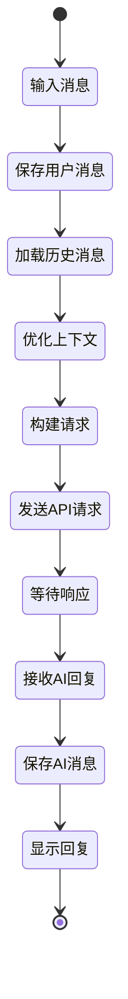

### 上下文优化流程

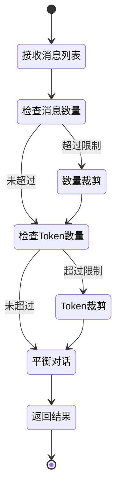

## 🗄️ 数据库设计

### 表结构

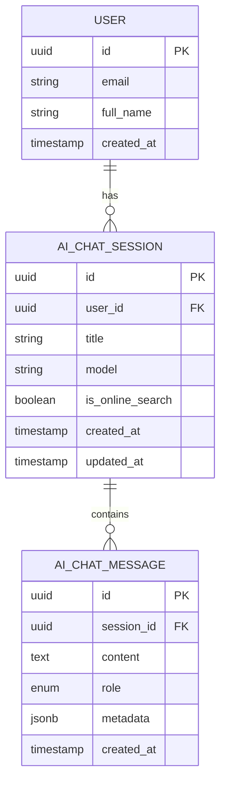

### 索引设计

```sql
-- 会话表索引
CREATE INDEX idx_ai_chat_session_user_id ON ai_chat_session(user_id);
CREATE INDEX idx_ai_chat_session_created_at ON ai_chat_session(created_at DESC);
CREATE INDEX idx_ai_chat_session_user_created ON ai_chat_session(user_id, created_at DESC);

-- 消息表索引
CREATE INDEX idx_ai_chat_message_session_id ON ai_chat_message(session_id);
CREATE INDEX idx_ai_chat_message_created_at ON ai_chat_message(created_at);
CREATE INDEX idx_ai_chat_message_session_created ON ai_chat_message(session_id, created_at);
```

## 🎨 前端组件结构

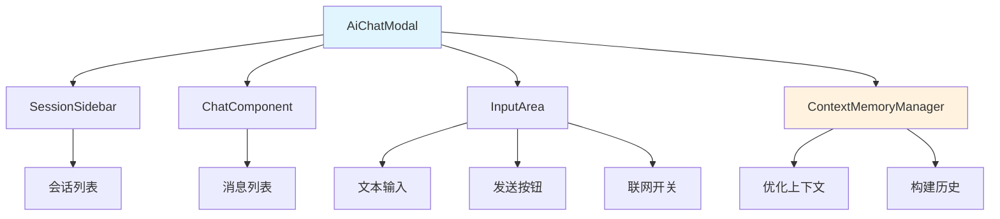

## 🔌 API接口设计

### POST /api/chat

**请求体**:

```typescript
{
  message: string;              // 当前消息
  model: string;                // AI模型
  isOnlineSearch?: boolean;     // 是否联网
  stream?: boolean;             // 是否流式
  conversationHistory?: Array<{ // 对话历史
    role: "user" | "assistant";
    content: string;
  }>;
  maxContextMessages?: number;  // 最大上下文数
  systemPrompt?: string;        // 系统提示词
}
```

**响应体**:

```typescript
{
  success: boolean;
  content?: string;             // AI回复内容
  usage?: {                     // Token使用情况
    prompt_tokens: number;
    completion_tokens: number;
    total_tokens: number;
  };
  model: string;
  duration: number;             // 耗时(ms)
  tracked: boolean;             // 是否记录
}
```

## 🧮 算法设计

### Token估算算法

```
function estimateTokens(text: string): number {
  // 1. 统计中文字符
  chineseChars = count(text, /[\u4e00-\u9fa5]/g)

  // 2. 统计英文单词
  englishWords = count(text.replace(/[\u4e00-\u9fa5]/g, '').split(/\s+/))

  // 3. 计算Token数
  tokens = ceil(chineseChars * 1.5 + englishWords * 1.0)

  return tokens
}
```

### 消息优化算法

```
function optimizeContext(messages: Message[]): Message[] {
  // 1. 按数量限制
  messages = messages.slice(-maxMessages)

  // 2. 按Token限制（从后往前累加）
  result = []
  totalTokens = 0
  for (i = messages.length - 1; i >= 0; i--) {
    tokens = estimateTokens(messages[i].content)
    if (totalTokens + tokens <= maxTokens) {
      result.unshift(messages[i])
      totalTokens += tokens
    } else {
      break
    }
  }

  // 3. 平衡对话（确保用户-助手配对）
  result = balanceConversation(result)

  return result
}
```

### 对话平衡算法

```
function balanceConversation(messages: Message[]): Message[] {
  result = []
  expectingRole = "user"

  for (msg of messages) {
    if (msg.role == expectingRole) {
      result.push(msg)
      expectingRole = (expectingRole == "user") ? "assistant" : "user"
    } else if (result.length > 0) {
      result.push(msg)  // 允许连续同角色
    }
  }

  return result
}
```

## 📊 性能优化策略

### 1. 前端优化

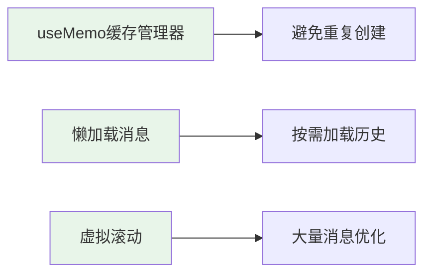

### 2. 后端优化

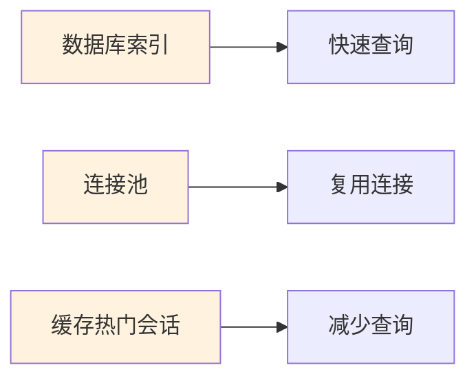

### 3. 算法优化

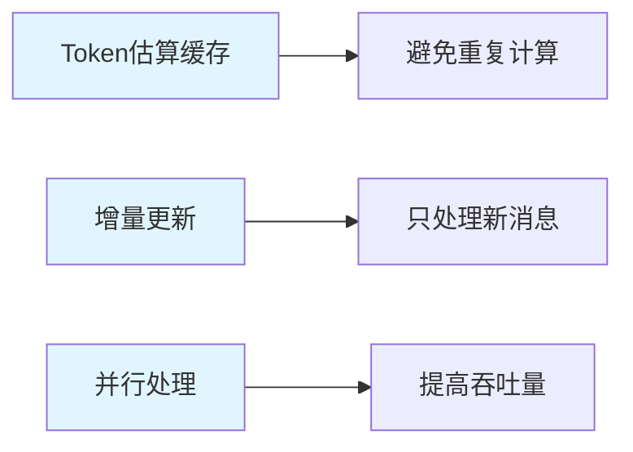

## 🔐 安全设计

### 数据隔离

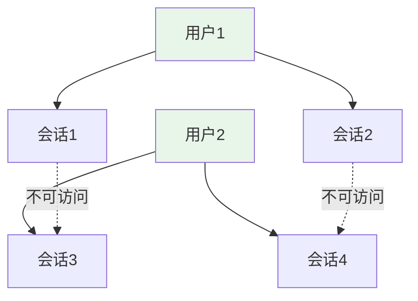

### 权限控制

- ✅ 用户只能访问自己的会话
- ✅ 会话级别的权限验证
- ✅ 数据库级别的外键约束
- ✅ API级别的身份认证

## 📈 扩展性设计

### 未来扩展方向

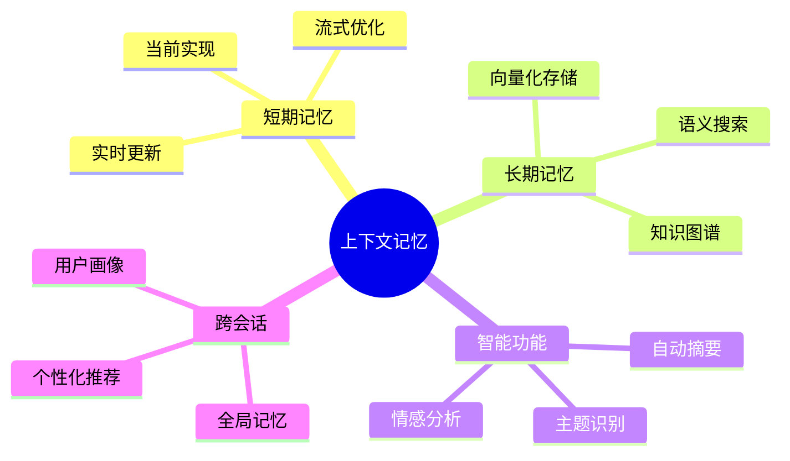

## 🎯 设计原则

1. **简单优先**: 从最简单的实现开始
2. **性能优先**: 确保不影响用户体验
3. **可扩展**: 预留扩展接口
4. **可维护**: 清晰的代码结构
5. **可测试**: 完善的测试覆盖

---

**文档版本**: v1.0  
**最后更新**: 2025-01-03  
**维护者**: 开发团队
