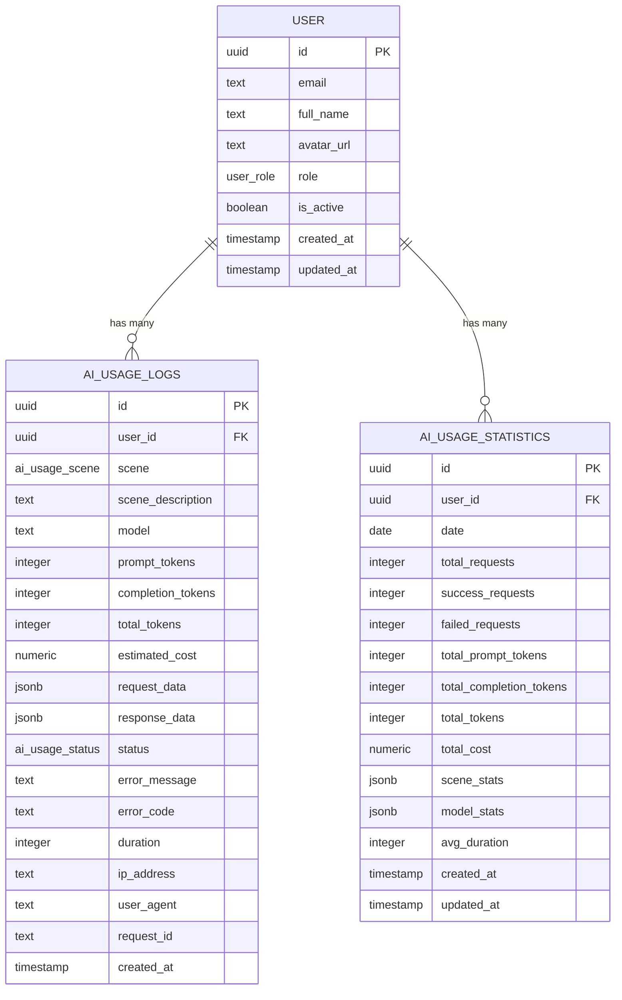
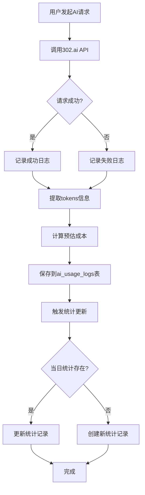
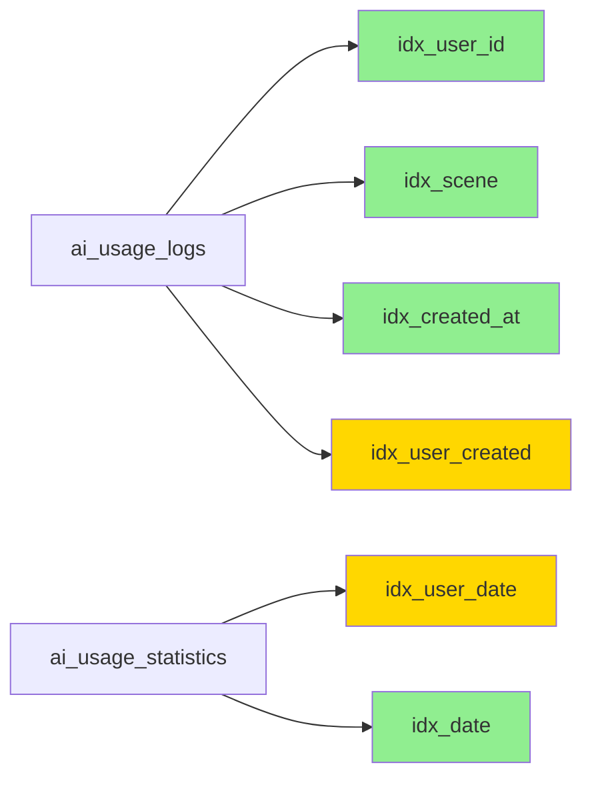
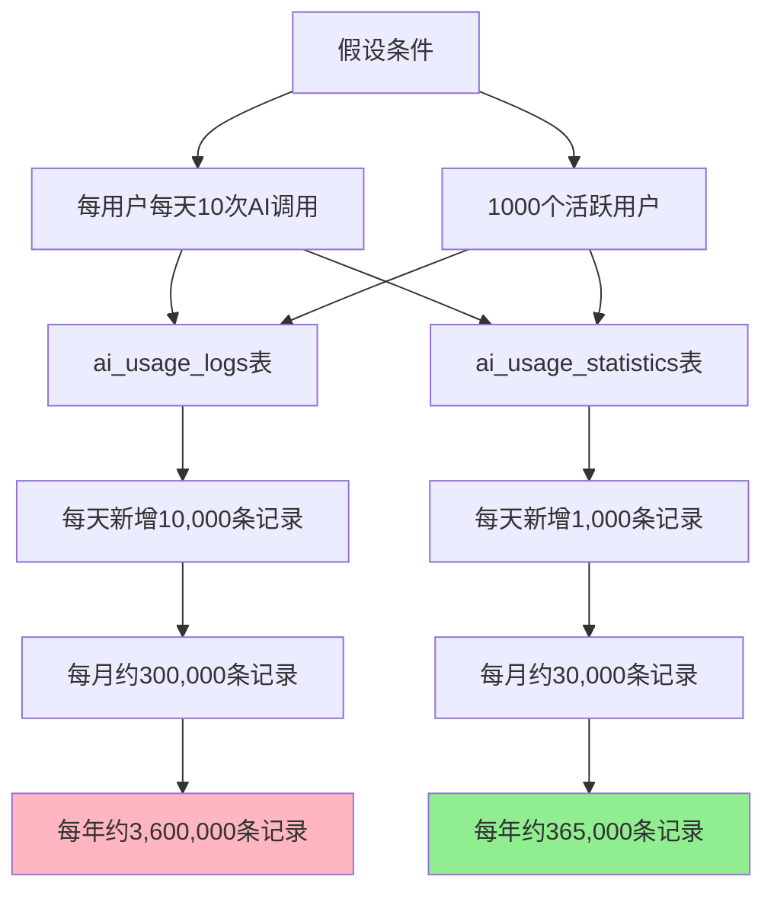
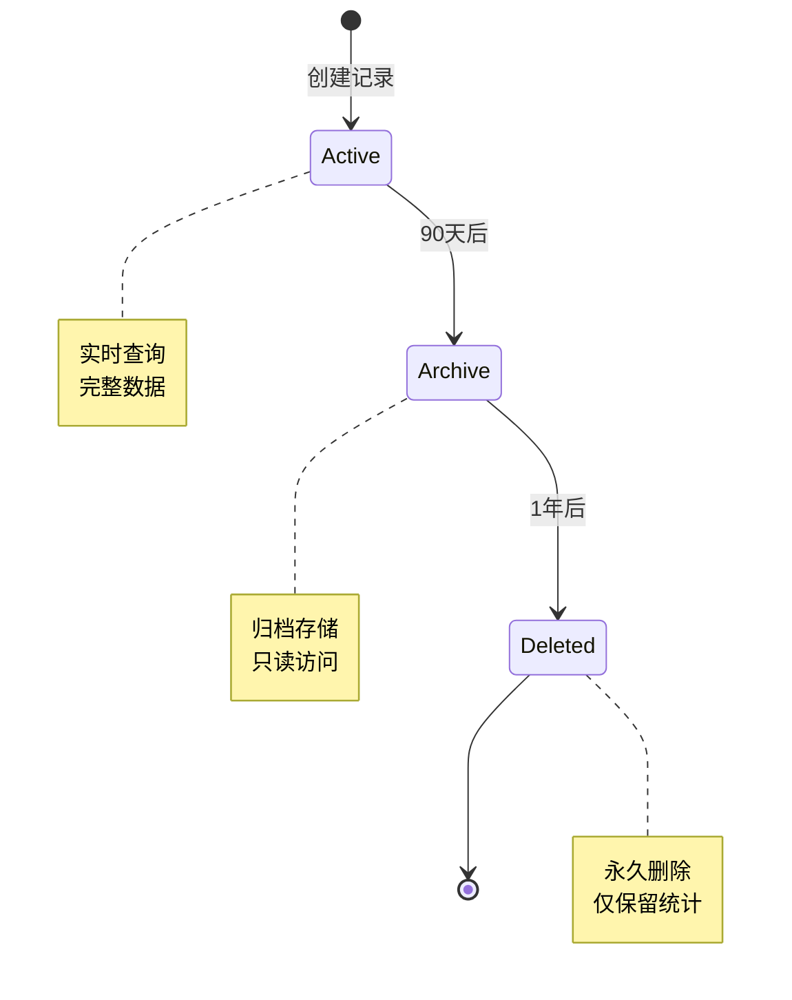

# AI使用记录数据库ER图

## 表关系说明

### 1. USER → AI_USAGE_LOGS (一对多)

- 一个用户可以有多条AI使用日志
- 通过 `user_id` 外键关联
- 级联删除：删除用户时，自动删除其所有AI使用日志

### 2. USER → AI_USAGE_STATISTICS (一对多)

- 一个用户可以有多条AI使用统计记录（按日期）
- 通过 `user_id` 外键关联
- 级联删除：删除用户时，自动删除其所有统计记录

## 数据流程图

## 查询性能优化

### 索引策略

**图例：**

- 🟢 绿色：单列索引
- 🟡 黄色：复合索引（性能最优）

### 常见查询场景

1. **查询用户最近的AI使用记录**

   - 使用索引：`idx_user_created`
   - 查询效率：⭐⭐⭐⭐⭐

2. **按场景统计使用情况**

   - 使用索引：`idx_scene`
   - 查询效率：⭐⭐⭐⭐

3. **查询用户每日统计**
   - 使用索引：`idx_user_date`
   - 查询效率：⭐⭐⭐⭐⭐

## 数据增长预估

### 存储空间估算

**ai_usage_logs表：**

- 平均每条记录：~2KB（包含JSONB数据）
- 年增长：3,600,000 × 2KB ≈ 7.2GB

**ai_usage_statistics表：**

- 平均每条记录：~1KB
- 年增长：365,000 × 1KB ≈ 365MB

**建议：**

- 定期归档超过90天的详细日志
- 保留统计数据用于长期分析
- 使用PostgreSQL分区表优化大表查询

## 数据生命周期

